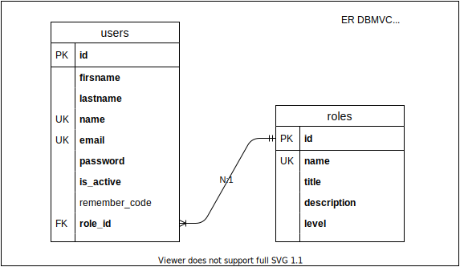

# Crear y probar la base de datos



## 1. DDL

### 1.1. Crear la base de datos y el usuario

> La versión de MariaDB que incluye XAMPP no agrega contraseña al usuario root.<br>En windows abrir el shell ubicado en panel de control de xampp.

```sh
# 1. Conectar al servidor
mysql -u root

# 2. Crear la base de datos dbmvc
mysql> create database dbmvc;

# 3. crear el usuario myuser
mysql> create user myuser@localhost identified by '123';

# 4. otorgarle permisos sobre la base de datos dbmvc
mysql> grant all on dbmvc.* to myuser@localhost;

# 5. desconectar del servidor
mysql> exit

# 6. conectar al servidor con el usuario myuser
mysql -u myuser -p

# 7. poner en uso la base de datos dbmvc
mysql> use dbmvc;
```

> Si llegaste a este paso sin errores has creado la base de datos y el usuario para la aplicación, continua con la creación de las tablas.

### 1.2. Crear las tablas

#### 1.2.1 Tabla users

```sql
create table `users` (
    `id` int unsigned auto_increment primary key,
    `firstname` varchar(50) not null,
    `lastname` varchar(50) not null,
    `name` varchar(16) not null unique,
    `email` varchar(100) not null unique,
    `password` varchar(200) not null,
    `is_active` tinyint(1) unsigned not null default 1,
    `remember_code` varchar(200) default null,
    `role_id` int unsigned not null
) engine=innodb charset=utf8mb4 collate=utf8mb4_general_ci;
```

#### 1.2.2 Tabla roles

```sql
create table `roles` (
    `id` int unsigned auto_increment primary key,
    `name` varchar(10) not null unique,
    `title` varchar(20) not null,
    `description` varchar(200) not null,
    `level` tinyint not null
) engine=innodb charset=utf8mb4 collate=utf8mb4_general_ci;
```

#### 1.2.4 Agregar las relaciones entre tablas

```sql
-- relacion users:roles n:1
alter table `users`
add constraint fk_users_roles__role_id
    foreign key (`role_id`)
    references `roles`(`id`)
        on update cascade
        on delete restrict;
```

## 2. DML

### 2.1. Insertar registros en la tabla roles

```sql
insert into `roles` (`name`,`title`,`description`,`level`)
values
    ('admin','Administrador','Los administradores tienen todos los permisos',1),
    ('edit','Editor','Los editores son los usuarios cotidianos con permisos para guardar información',2),
    ('guest','Invitado','Los invitados son usuarios con permisos limitados',3),
    ('blocked','Bloqueado','Rol para usuarios indeseados',0);
```

### 2.2. Insertar registros en la tabla users

```sql
insert into `users` (`firstname`,`lastname`,`name`,`email`,`password`,`role_id`)
values
    ('Bidkar','Aragon','bidkar','bidkar.aragon@udo.mx','123',1),
    ('Jose Luis','Gaxiola','cheluis','cheluis.gaxiola@udo.mx','123',2),
    ('Jesus','Lopez','chuyito','chuyito.lopez@udo.mx','123',3),
    ('Covid','Diecinueve','covid19','covid.19@ya.dejanos.salir','123',4);
```

### 2.3. Probar registros relacionados

```sql
select u.`id`,
       u.`name`,
       u.`email`,
       u.`is_active`,
       r.`title` 'role'
  from `users` u
  join `roles` r
    on u.`role_id` = r.`id`;
```

## Referencias

-   [MySQL Data Types](https://www.mysqltutorial.org/mysql-data-types.aspx)
-   [MySQL ALTER TABLE](https://dev.mysql.com/doc/refman/8.0/en/alter-table.html)
-   [MySQL SHOW INDEXES](https://www.mysqltutorial.org/mysql-index/mysql-show-indexes/)
