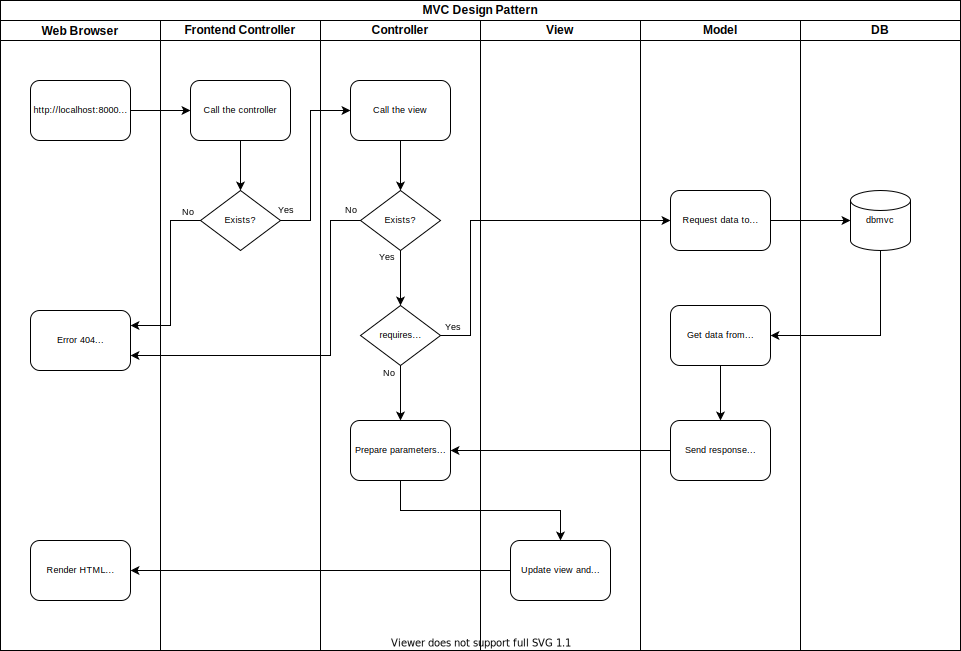

# Patrón MVC



```
Classes
Namespaces
Autoloading
Documentation code
Constants
    Settings

MVC Directory Structure
    app/
        models*.php
        controllers/
            controllers*.php
        views
    libs/
        libs*.php
    public/
        css/*.css
        js/*.js
        images/*.jpg
        index.php
        .htaccess
    config/
        configs*.php
    routes.php
    .env
```
